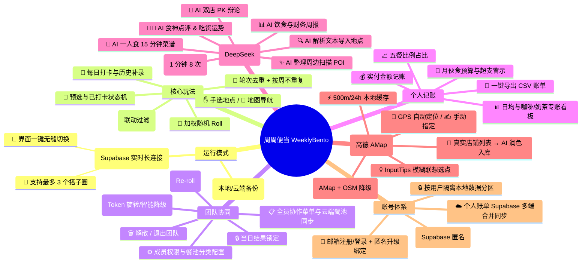
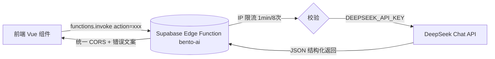
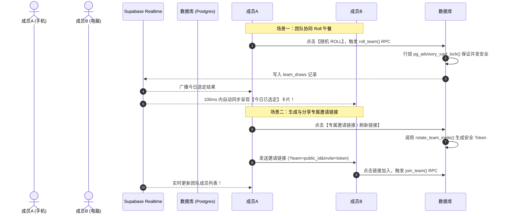

# 🍱 周周便当 (WeeklyBento) 玩法规则与复盘文档

> 本文档用于归纳总结《周周便当》系统的核心玩法、算法规则、AI 能力、多团队协同逻辑、安全邀请机制、个人云同步与技术架构，方便后续产品复盘与维护扩展。
>
> 📅 最后更新：2026-08（v1.1 时代：AI 六大场景 + 周边美食扫描已上线）

---

## 📌 一、 项目概览

《周周便当》是一款致力于解决**"今天中午吃什么"**终极难题的随机午餐决策与团队协同工具。系统兼顾个人独立使用与多团队多人协同，具备高颜值 3D 老虎机滚轮动画、Web Audio 合成音效、全屏撒花特效，并深度集成了 **DeepSeek AI 六大能力**与**高德周边真实美食扫描**。



---

## 🎲 二、 核心玩法与选餐算法规则

### 1. 加权随机 Roll 算法 (Weighted Random Selection)
- 每个午餐地点均具备权重值 `weight`（默认值 `1`，范围可自定义）。
- **抽取逻辑**：系统计算待抽池中所有可用地点的权重总和 `totalWeight`，生成随机数 `target = Math.random() * totalWeight`，以此进行加权概率抽签。

### 2. 轮次去重机制 (Round Anti-Repeat) + 按周不重复 (Weekly No-Repeat)
- **轮次去重**：开启后，已抽中的地点将被标记为 `isDrawn = true` 并暂时移出待抽池；当待抽池所有地点均被抽过一遍时，系统自动清空已抽状态（或由用户手动重置），开启新一轮选餐。
- **按周不重复 (weeklyNoRepeat，默认开启)**：系统会计算本周一（`Asia/Shanghai` 时区）以来的所有已打卡地点，将**本周吃过的地方从待抽池中排除**，保证一周 5 个工作日不重样；如果排除后池子空了，则自动降级回全量池继续抽取。
- **降级策略**：抽取时会逐级降级——当前餐池未抽池 → 当前餐池全量池 → 全地点未抽池 → 全量地点，确保任何时候都能抽得出结果。

### 3. 🌅 5大场景餐池分类过滤 (Meal Categories Filtering)
- **五大池子**：`🌅 早餐池`、`☀️ 午餐池`、`🧋 咖啡/奶茶池`、`🌙 晚餐池`、`🌌 夜宵池`（分类可在管理员控制台勾选启停，团队模式由团队权限配置）。
- **自动时间匹配**（依据 `Asia/Shanghai` 时区）：
  - `06:00 - 10:00` ➔ 默认推荐并定位到 **早餐池**
  - `10:00 - 14:00` ➔ 默认推荐并定位到 **午餐池**
  - `14:00 - 17:00` ➔ 默认推荐并定位到 **咖啡/奶茶池**
  - `17:00 - 21:00` ➔ 默认推荐并定位到 **晚餐池**
  - 其余时段 ➔ 默认定位到 **夜宵池**
- **联动抽取过滤**：切换餐池 Tab 后，老虎机待抽池会**自动精准过滤**仅包含该餐池支持的地点列表（个人菜单或团队云端同步菜单均生效）。

### 4. 📌 预选计划态与 ✅ 确认打卡态状态机流转 (Planned vs Confirmed Status)
- **预选计划 (Planned)**：用于早晨进行计划，摇号产生预选卡片，可直接进行 `[🔄 重新 Roll]` 而不产生脏数据；同一天同一餐别的预选会被新 Roll 覆盖。
- **确认打卡 (Confirmed)**：
  - 用户去吃后点击 `[✅ 确认吃了]` 即可转为已打卡状态，并支持在个人模式下补录实际实付金额与美食心得备注。
  - **跨日未结清理 Banner**：跨天首次加载应用时，系统自动识别并过滤出未做结算的预选，以 Banner 呈现：`"您有 X 条昨日未确认的预选计划：[🧹 一键作废]"`，保证记账准确性。
  - **单餐别多条打卡**：同一天允许在不同餐别分别打卡多条记录。

### 5. 💰 个人记账与月度膳食预算预警 (Expense Tracking & Budget)
- **膳食消费看板**：个人历史页提供本月饮食总开销、日均消费（近30天）、"🧋 咖啡/奶茶专账（杯数与金额）"统计卡片。
- **五餐占比图**：根据实付金额，直观展示 5 大餐别在月开销中的占比进度条。
- **月伙食预算与超支警示**：可在控制台设置"月度膳食预算（如 ￥1500）"；进度条 <80% 绿色健康、80%~100% 黄色警告、>100% 红色超支警报。
- **明细账单 CSV 一键导出**：带 Excel BOM 的标准 CSV（日期、餐别、地名、状态、金额、备注、标签），供财务分析。

### 6. 🔒 打卡数据快照解耦隔离与自由编辑
- **独立字段快照**：每天打卡记录（`DailyRecord`）生成时仅永久固化当时的名字文本（`locationName`）、Emoji、金额、地址/导航链接等快照字段。
- **地点库变更免打扰**：之后管理员删除或修改地点库，历史打卡账单照常显示当时的名字。
- **自由修改名称**：历史列表中支持 ✏️ 编辑本笔记录的名称与金额，与基础地点库完全解耦。

### 7. ✋ 手选地点与 📍 精准地图导航
- **手选地点**：老虎机界面提供弱化版"手选"入口，在不想随机时直接手动选定一个地点（个人与团队模式均支持，实时同步）。
- **精准导航**：地点可配置 `mapUrl` 或 `address`；抽中结果弹窗会自动出现 `📍 导航去吃` 按钮，一键跳转地图导航。

### 8. 📥 批量导入与智能解析 (本地规则 + AI 双重引擎)
- **本地规则解析 (`parseBatchText`)**:支持多行文本批量导入，识别 `名称(标签:..|价格:..|招牌:..|地址:..)` 或 `名称|标签|价格|地址` 格式，自动匹配 Emoji 与餐池分类，可提取地址字段。
- **AI 智能解析 (`parse_location`)**：粘贴散乱的推荐文案、微信安利、小票文字，由 DeepSeek 解析为标准地点 JSON。
- **截图 OCR 识别自动填表**：上传餐厅图片/截图（Tesseract.js + 图片压缩），OCR 识别文字后交给 AI 解析自动填充地点表单。

---

## 🤖 三、 AI 智能能力 (DeepSeek via Supabase Edge Function)

所有 AI 场景统一经由 Supabase Edge Function **`bento-ai`** 转发到 DeepSeek（`deepseek-chat`），前端不直接持有 AI Key，安全性高。



### 1. 🔍 AI 智能解析非结构化文本 → 导入地点 (`parse_location`)
- 输入散乱介绍/微信文案/小票文字，输出 `{ name, emoji, tags, priceRange, recommendedDish }`。
- 应用位置：地点管理后台"AI 解析导入"、批量文本导入、地点表单截图识别。

### 2. 🧑🍳 AI 食神点评 & 吃货运势 (`food_review`)
- 抽中地点后生成 **80 字以内**的风趣点评 + 今日吃货运势小建议 + 食神推荐搭档，结合当前餐池类型。
- 应用位置：抽中结果弹窗 `[✨ 食神点评]` 按钮。

### 3. 📊 AI 饮食与财务周报 (`weekly_report`)
- 基于近 N 天打卡明细 + 阶段总花费 + 月度预算，生成趣味卡片式周报 JSON：`吃货称号 / 习惯点评 / 健康建议 / 理财提示`。
- 应用位置：历史页 `[✨ AI 饮食周报]`（需登录正式账号，游客有呼吸动效引导）。

### 4. 🤼 AI "救救纠结症" 双店 PK 辩论 (`food_debate`)
- 两位评委【热量快乐派】VS【健康减脂派】围绕两个餐厅展开 3 轮幽默互掐，最终裁判给出 `winner + verdict`。
- 应用位置：老虎机页 `[🤼 AI 救救纠结症]` 按钮，在待抽地点中任选两家 PK。

### 5. 🍳 AI 一人食 15 分钟极简菜谱 (`generate_recipe`)
- 输入菜名（或识别图片文字），生成 `难度 / 时长 / 食材用量 / 步骤 / 大厨避坑秘诀` 的极简快手菜谱。
- 应用位置：抽中结果弹窗 `[🍳 查看 AI 简易菜谱]`。

### 6. ✨ AI 整理周边扫描 POI (`organize_scanned_locations`)
- 将扫描到的周边真实商家清单批量增强为 WeeklyBento 标准地点对象（Emoji、标签、人均、推荐菜、餐池分类）。
- **强效兜底保全原生数据**：AI 仅能增强 `tags / priceRange / recommendedDish / mealCategories` 等元数据，**店名 `name`、地址 `address`、距离 `distance` 以高德 POI 为唯一真实来源，AI 永不替换**。

### 7. 🛡️ 限流与容错
- **IP 限流防刷**：Edge Function 内存级限流，单 IP 1 分钟内最多调用 8 次，超限返回 429 友好提示。
- **前端错误分级**：429（频率限制）→ 400（云函数未更新）→ 500（未配置 Key），前端给出针对性修复指引。
- **JSON 解析兜底**：AI 返回非 JSON 时自动降级为内置默认数据，保证功能永不白屏。

---

## 📍 四、 周边美食扫描与 AI 维护入库 (AMap)

基于**高德地图 Web API** 的周边真实美食雷达，替代早期纯模拟数据（现已禁用模拟，未配置 Key 时返回空列表而非虚构数据）。

### 1. 三种定位方式
- **GPS 自动定位**：HTML5 Geolocation（高精度模式），获取坐标后异步逆地理编码显示可读地名。
- **手动指定位置**：输入城市/写字楼/商圈，调用高德 `geocode/geo` 地理编码定位；带 **InputTips 模糊联想**下拉（180ms 防抖），命中带坐标的联想项可直接精准扫描。
- **逆地理编码**：优先高德 `regeo`，失败降级 OpenStreetMap Nominatim，最后兜底显示坐标。

### 2. 扫描筛选
- 范围 500m / 1000m / 2000m 三档；类型筛选：全部美食 / 快餐小吃 / 奶茶咖啡（映射高德 `types` 分类码）。
- 结果展示**真实店铺**：店名、地址、精确距离（米）、高德分类、电话；默认勾选未入库地点，避免重复导入。

### 3. ⚡ 500m / 24h 本地缓存
- 同一坐标 500 米内、24 小时内命中缓存直接秒开（带缓存距离与时间提示），可一键"重新扫描"强制刷新。

### 4. ✨ AI 润色预览确认导入（两步）
- **第一步**：勾选目标店铺 → `[✨ AI 润色分类并维护导入]`，AI 为选中店铺生成 Emoji、标签、人均、推荐菜与餐池分类（店名/地址/距离始终以高德原始数据为准，AI 不可改）。
- **第二步**：进入**可编辑预览面板**，逐项微调 Emoji、标签、人均、推荐菜与餐池勾选；**导入目标可选**（个人地点池或任一已加入的搭子圈菜单，排除只读成员，导入后自动切换到所选搭子圈），确认后批量写入——AI 结果可见可控。
- **分页**：支持"加载更多"（每页 20 条，按 POI id 去重追加），缓存命中场景同样可继续加载。

### 5. 权限异常引导
- 检测到浏览器定位权限被禁用时，自动切换手动指定模式并提示引导，不阻塞使用。

---

## 👥 五、 团队协同与多搭子圈模式 (Multi-Team Workspace)

团队模式基于 **Supabase Realtime 实时长连接** 构建，专为公司部门、干饭小分队设计。



### 1. 🏢 多搭子圈创建与无缝切换 (上限 3 个)
- **配额管理**：单个正式账号最多创建或加入 **3 个午餐搭子圈**。
- **快速切换**："搭子圈"弹窗列出所有已加入团队卡片，一键切换当前激活圈与菜单。
- **同步个人菜单**：创建新搭子圈时可勾选"同步我当前的个人地点作为初始菜单"。

### 2. 🔗 专属安全邀请链接与智能降级
- 调用 `rotate_team_invite` RPC 生成加密 `invite` Token（`?team=PUBLIC_ID&invite=TOKEN`，Token 仅存 SHA-256 哈希）。
- **缓存防失效**：优先复用已导出的有效 Token 链接，并提供【刷新链接】手动重置。
- **智能容错降级**：Token 旋转失败时平滑降级为基础 `public_id` 邀请链接，保证功能 100% 可用。

### 3. 🔒 匿名游客限制与引导
- 匿名游客无法创建/加入搭子圈；打开团队弹窗时呈现专属引导 Banner，一键跳转登录/注册绑定。

### 4. 当日选定结果锁定与 🔄 全员 Re-roll
- **首 Roll 锁定**：每日首个 Roll 签的成员为全团队锁定今日结果，其余成员打开页面直接看到选定结果。
- **全员 Re-roll**：对结果不满意可点击【重新选定】重抽，全员页面实时更新（是否允许普通成员 Re-roll 由团队权限控制）。

### 5. 📝 全员协作菜单与补录打卡
- 全员支持添加/编辑/删除地点（权限由 `allowMemberEditLocation` 控制）、批量文本导入、恢复预设 25 个美食池。
- 支持精准显示周几（如 `今天 (周二)`），自由补录或修正过去日期的团队打卡，修改实时广播。

### 6. ⚙️ 团队权限与餐池配置（云端同步）
- 团队所有者/管理员可配置：`allowMemberReroll`（成员可否重 Roll）、`allowMemberEditLocation`（成员可否编辑菜单）、`enabledMealCategories`（启用的餐池分类），个人模式与团队模式餐池配置相互独立。
- **权限已上云**：权限写入 `teams.permissions` jsonb 列（`update_team_permissions` RPC），跨设备实时一致；本地 localStorage 仅作离线降级缓存，上线后以云端为准。
- **成员移除（踢人）**：owner/admin 可移除非 owner 成员（`remove_team_member` RPC，后端保护 owner 不可被移除），成员列表带彩色头像。

### 7. 🔥 团队解散与 🚪 退出
- **解散团队 (Owner)**：清除云端数据，全员自动切回个人模式。
- **退出团队 (Member)**：主动解除团队关联。

---

## 👤 六、 账号体系与多端同步 (Auth System)

基于 **Supabase Auth（匿名 + 邮箱密码）** 实现"游客免登录 + 可选注册绑定"的无缝体验：

| 身份类型 | 登录方式 | 数据同步范围 | 团队协同权限 |
| :--- | :--- | :--- | :--- |
| **👻 匿名游客 (Guest)** | 首次打开自动 `signInAnonymously` | 仅当前浏览器本地数据分区（按 user_id 隔离） | 仅个人模式，不可使用搭子圈 |
| **👤 正式账号 (Authenticated)** | 邮箱 + 密码 登录/注册 | **多端全域实时同步（Supabase 云端合并）** | 支持创建/加入最多 3 个搭子圈 |

### 关键机制
- **匿名升级绑定**：在匿名 Session 下直接调用 `signUp`，Supabase 会自动将当前匿名 user_id 升级为邮箱密码账号，本地数据无缝继承。
- **密码管理**：已登录账号支持修改密码（`updateUser`）；登录页支持"忘记密码"发送重置邮件（`resetPasswordForEmail`，需在 Supabase 后台配置 Site URL/Redirect URL）。
- **本地数据按账号隔离**：每个 user_id 一套 localStorage 命名空间（`key__u_<userId>`），多账号不串数据。
- **旧数据迁移**：旧版单用户 localStorage 数据只迁移给第一个在该设备上同步的账号。
- **哈希错误清理**：自动清除 URL 中的 OAuth error 参数，避免污染历史记录。

---

## ☁️ 七、 个人账单云同步 (Supabase Multi-Device Sync)

个人模式（地点池、打卡记录、设置）默认通过 Supabase 按登录用户同步，替代早期 JSONBin 方案。

- **合并策略**：按记录 id 去重，取 `updatedAt` 较新的版本；云端与本地**只合并、不互相覆盖**，多设备各自录入的数据都会保留。
- **增量推送**：推送前读取云端时间戳，只上传"本地更新"的行，避免旧数据覆盖新数据。
- **删除传播（墓碑）**：本地删除记录"墓碑"（`user_deletions`，90 天过期），其他设备拉取后同步删除，避免删除的数据复活。
- **设备级设置不外传**：管理员密码、同步配置、当前模式等设备级设置不进入云端，避免跨设备误覆盖。
- **收敛回写**：拉取合并后的并集会自动回写云端，保证所有设备收敛到同一份数据。
- **自动同步**：本地数据变化后 800ms 防抖自动推送（可关闭）。
- **实时多端刷新（Realtime）**：`user_records / user_locations / user_settings / user_deletions` 已接入 Supabase Realtime 订阅（按 `user_id` 过滤），其他设备的新增/修改/删除约 1 秒内自动同步到本端；订阅逻辑抽取为可复用 `useRealtimeSync` composable（模块级单例，防抖窗口内累积事件批一次性回调 + 严格时间戳回声抑制，避免自己写入触发同步环），顶部导航实时显示连接状态徽标（连接中/实时同步中/已离线）。
- **已知边界**：多设备同时修改同一笔记录按"最后修改者胜出"；Realtime 订阅失败时自动降级为打开页面/手动"立即同步"。

---

## 🛡️ 八、 数据库权限 (RLS) 与技术架构复盘

### 1. 表结构总览
| 数据域 | 表 | 说明 |
| :--- | :--- | :--- |
| 团队 | `teams` / `team_members` / `team_locations` / `team_draws` | 搭子圈、成员角色、菜单、每日抽取结果 |
| 个人同步 | `user_records` / `user_locations` / `user_settings` / `user_deletions` | 个人账单/地点/设置/删除墓碑（`personal_sync.sql` 迁移） |

### 2. 核心 RPC 与鉴权 helper
```sql
-- 团队成员鉴权 helper 函数
create or replace function public.is_team_member(target_team_id uuid)
returns boolean language sql stable security definer set search_path = public
as $$
  select exists (select 1 from team_members where team_id = target_team_id and user_id = auth.uid());
$$;

-- 安全旋转团队邀请 Token
create or replace function public.rotate_team_invite(p_team_id uuid)
returns text language plpgsql security definer set search_path = public, extensions
as $$
declare new_token text := encode(gen_random_bytes(18), 'hex');
begin
  if not public.can_manage_team(p_team_id) then raise exception 'manager permission required'; end if;
  update teams set invite_token_hash = encode(digest(new_token, 'sha256'), 'hex') where id = p_team_id;
  return new_token;
end;
$$;
```

- **RPC 清单**：`is_team_member` / `can_manage_team` / `create_team` / `join_team` / `get_team_members` / `get_my_teams` / `open_team` / `rotate_team_invite` / `roll_team`（`pg_advisory_xact_lock` 并发安全）。
- **AI 服务**：`supabase/functions/bento-ai/index.ts`（Deno + DeepSeek），动作路由：`parse_location / food_review / weekly_report / food_debate / generate_recipe / organize_scanned_locations`。

### 3. 前端工具层
- `utils/date.ts`（Asia/Shanghai 统一时区）、`utils/error.ts`（统一错误文案）、`utils/imageCompressor.ts`（OCR 前图片压缩）、`utils/locationService.ts`（高德定位/POI/缓存）、`utils/parseBatchText.ts`（本地批量解析）。

---

## 📄 九、 生产环境部署指引

- **上线发布命令**：
  ```bash
  npm run deploy
  ```
- **构建工作流**：执行 `vue-tsc -b && vite build` 打包构建 `dist`，并由 `gh-pages` 部署至 GitHub Pages。
- **在线部署 URL**：[https://wangdengbin.github.io/weeklybento/](https://wangdengbin.github.io/weeklybento/)
- **环境变量**：`.env` 需配置 `VITE_SUPABASE_URL` / `VITE_SUPABASE_ANON_KEY`（必填）与 `VITE_AMAP_KEY`（高德 Web 服务 Key，用于周边扫描）。
- **云端 AI 部署**：Supabase Dashboard 粘贴部署 `bento-ai` Edge Function，并配置 `DEEPSEEK_API_KEY` Secret（详见 `doc/SUPABASE_EDGE_FUNCTIONS_AI.md`）。

---

## 🔧 九·五、 体验优化基线 (2026-08 已落地)

- **全局 Toast / Confirm 系统**：替换全站 47 处原生 `alert/confirm`，统一玻璃拟态轻提示（成功/错误/信息三态、可带动作按钮）+ 自定义确认弹窗（危险色、ESC 关闭）。
- **文本可复制**：移除全局 `user-select: none`，按钮等交互元素才禁用，历史记录/地名可正常选中复制。
- **桌面端响应式**：>768px 容器加宽至 920px，餐池 Tab 均分、打卡清单双列、结果卡片放大。
- **历史记录**：按月分组标题 + 首屏 30 条"加载更多"；补录表单支持从地点池联想（datalist）；删除记录带 6.5s **撤销** Toast。
- **结果弹窗主次层级**："确认吃了"为主操作并排"先存预选"，"再 Roll"弱化为文字链接。
- **周边扫描**：AI 润色结果**可预览可编辑**后再入库；支持分页加载更多。
- **账号**：支持修改密码与"忘记密码"重置邮件。
- **字体本地化**：移除 Google Fonts 外链依赖，改用系统字体栈，规避国内加载失败/闪字。

---

## 🚀 十、 后续能力规划 (Roadmap)

基于当前产品定位（随机午餐决策 + 团队协同 + AI 辅助 + 记账）与已暴露的短板，按价值/成本排序：

### P0 近期 · 补齐体验闭环（成本低、价值高）
| # | 能力 | 说明 |
| :-- | :-- | :-- |
| 1 | ~~个人账单 Realtime 实时同步~~ ✅ 已完成 | 已接入 `user_records/user_locations/user_settings/user_deletions` 的 Realtime 订阅，多端真实时，带回声抑制与失败降级。 |
| 2 | **扫描结果一键导航** | 周边扫描结果当前仅能导入地点池；为 POI 生成 `mapUrl`（高德 URI API），让"扫描 → 导入 → 导航"闭环。 |
| 3 | **扫描与地点池相似度去重** | 导入前按名称相似度/距离提示"该店已在池中"，避免重复维护。 |
| 4 | **团队模式 AI 周报** | 周报目前仅覆盖个人记录；团队可基于 `team_draws` 生成"团队干饭周报"（谁 Roll 得多、最受欢迎餐厅）。 |

### P1 中期 · 增强决策与粘性（中等成本）
| # | 能力 | 说明 |
| :-- | :-- | :-- |
| 5 | **打卡数据可视化看板** | 周/月消费趋势折线图、餐池分布热力图、最常打卡 TOP10，让记账数据"看得见"。 |
| 6 | **每日午餐提醒** | 基于浏览器 Notification + 定时检查，到点提醒"该 Roll 午餐啦"；进阶可做 PWA 推送。 |
| 7 | **PWA 离线化** | manifest + Service Worker 缓存，离线也能 Roll、打开秒开，移动端可"添加到主屏幕"。 |
| 8 | **高德 POI 详情增强** | 展示评分、人均、营业时间、招牌图等（`place/detail`），帮助用户决策。 |
| 9 | **团队投票选餐** | 除单人 Roll 外，支持成员对候选餐厅投票表决，民主决策适配团建场景。 |
| 10 | **预算智能预警通知** | 接近/超出预算时主动提醒 + 推荐平价替代地点。 |

### P2 远期 · AI 深度化与生态（高价值）
| # | 能力 | 说明 |
| :-- | :-- | :-- |
| 11 | **AI 一周餐单规划师** | 结合预算、口味标签、营养均衡自动排一周 5 天餐单，一键生成可执行的打卡计划。 |
| 12 | **AI 营养健康分析** | 结合打卡数据与菜谱库，输出营养缺口与改善建议（配合食物营养成分数据）。 |
| 13 | **多语言 i18n** | 支持中/英文切换，扩大受众。 |
| 14 | **移动端小程序版本** | 微信小程序/移动 H5 适配，解决"手机与电脑"之外的场景（扫码即用）。 |
| 15 | **团餐聚合下单** | 抽中结果一键跳转美团/饿了么搜索下单，从"选什么"到"吃什么"全链路打通。 |

> 💡 **建议优先级**：P0-1（Realtime 同步）✅ 已完成；下一步做 P0-2（扫描结果一键导航闭环）与 P0-3（扫描相似度去重）——均命中现有体验短板，改动集中在既有代码路径。
