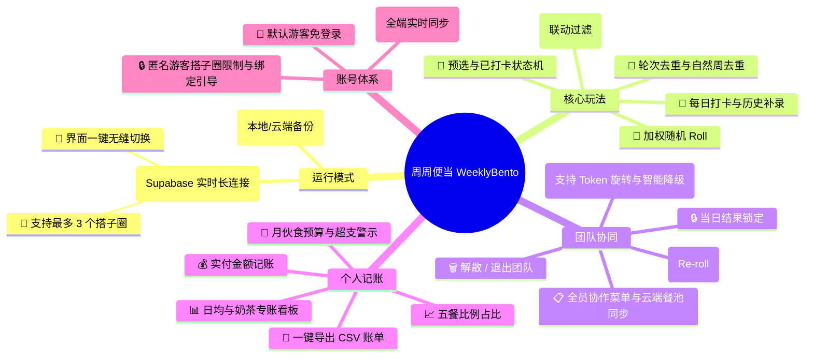
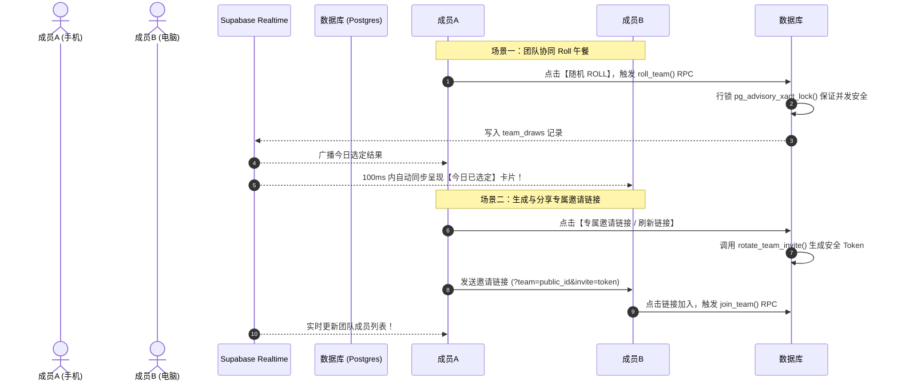

# 🍱 周周便当 (WeeklyBento) 玩法规则与复盘文档

> 本文档用于归纳总结《周周便当》系统的核心玩法、算法规则、多团队协同逻辑、安全邀请机制与技术架构，方便后续产品复盘与维护扩展。

---

## 📌 一、 项目概览

《周周便当》是一款致力于解决**“今天中午吃什么”**终极难题的随机午餐决策与团队协同工具。系统兼顾个人独立使用与多团队多人协同，具备高颜值 3D 老虎机滚轮动画、Web Audio 合成音效与全屏撒花特效。



---

## 🎲 二、 核心玩法与选餐算法规则

### 1. 加权随机 Roll 算法 (Weighted Random Selection)
- 每个午餐地点均具备权重值 `weight`（默认值 `1`，范围可自定义）。
- **抽取逻辑**：系统计算待抽池中所有可用地点的权重总和 `totalWeight`，生成随机数 `target = Math.random() * totalWeight`，以此进行加权概率抽签。

### 2. 轮次去重机制 (Round Anti-Repeat)
- 开启轮次去重后，已抽中的地点将被标记为 `isDrawn = true` 并暂时移出待抽池。
- **循环复用**：当待抽池中所有地点均被抽过一遍时，系统自动清空已抽状态（或由用户手动重置），开启新一轮选餐。

### 4. 🌅 5大场景餐池分类过滤 (Meal Categories Filtering)
- **五大池子**：`🌅 早餐池`、`☀️ 午餐池`、`🧋 奶茶下午茶池`、`🌙 晚餐池`、`🌌 夜宵池`。
- **自动时间匹配**：系统首次加载时，自动获取当前系统时间：
  - `05:00 - 09:30` ➔ 默认推荐并定位到 **早餐池**
  - `14:00 - 16:30` ➔ 默认推荐并定位到 **奶茶/下午茶池**
  - `16:30 - 21:00` ➔ 默认推荐并定位到 **晚餐池**
  - `21:00 - 05:00` ➔ 默认推荐并定位到 **夜宵池**
  - 其它时间默认定位到 **午餐池**。
- **联动抽取过滤**：切换餐池 Tab 后，老虎机待抽池会**自动精准过滤**仅包含该餐池支持的地点列表（无论是个人菜单还是团队云端同步菜单），实现精确定向抽取。

### 5. 📌 预选计划态与 ✅ 确认打卡态状态机流转 (Planned vs Confirmed Status)
- **预选计划 (Planned)**：用于早晨进行计划，摇号产生预选卡片，可直接进行 `[🔄 重新 Roll]` 而不产生脏数据。
- **确认打卡 (Confirmed)**：
  - 用户去吃后点击 `[✅ 确认吃了]` 即可转为已打卡状态，并支持在个人模式下补录实际实付金额与美食心得备注。
  - **跨日未结清理 Banner**：当跨天首次加载应用时，系统会智能识别并过滤出未做结算的预选，以 Banner 横幅呈现：`“您有 X 条昨日未确认的预选计划：[🧹 一键作废]”`，保证记账准确性。

### 6. 💰 个人记账与月度膳食预算预警 (Expense Tracking & Budget)
- **膳食消费看板**：在个人历史页，提供本月饮食总开销、日均消费（近30天）、以及“**🧋 奶茶专账（杯数与金额）**”统计卡片，直观把控奶茶开支。
- **五餐占比图**：根据记账实付金额，直观展示 5 大餐别在月开销中占用的比例进度条。
- **月伙食预算与超支警示**：
  - 可在控制台设置“月度膳食预算（如 ￥1500）”。
  - 进度条在已用 <80% 展示绿色健康态；在 80%~100% 出现黄色警告；大于 100% 出现红色超支警报，提示理性消费。
- **明细账单 CSV 一键导出**：支持将个人历史记账记录以标准的带有 Excel BOM 的 CSV 格式（包含日期、餐别、地名、状态、金额、备注、标签）一键导出至本地做财务分析。

### 7. 🔒 打卡数据快照解耦隔离与自由编辑
- **独立字段快照**：每天的打卡记录（`DailyRecord`）生成那一刻，仅永久固化保存当时的名字文本（`locationName`）、Emoji、金额及备注等快照字段。
- **地点库变更免打扰**：如果之后管理员在“地点库”中删除了或修改了该地点，**历史打卡账单和页面依然完全不受影响、照常完美显示当年的地点名字**。
- **自由修改名称**：在历史列表中点击 ✏️【编辑】时，支持自由修改本笔记录的历史地点名称及金额，完全与基础地点库解耦，保证账单的绝对可编辑。

---

## 👥 三、 团队协同与多搭子圈模式 (Multi-Team Workspace)

团队模式基于 **Supabase Realtime 实时长连接** 构建，专为公司部门、干饭小分队设计。



### 1. 🏢 多搭子圈创建与无缝切换 (上限 3 个)
- **配额管理**：单个正式账号最多可同时创建或加入 **3 个午餐搭子圈**。
- **快速切换**：在“搭子圈”弹窗中列出所有已加入的团队卡片，点击【切换】按钮即可无缝切换当前激活的搭子圈及对应菜单。
- **同步个人菜单**：创建新搭子圈时，可选择勾选“同步我当前的个人地点作为初始菜单”，快速搭建团队菜单。

### 2. 🔗 专属安全邀请链接与智能降级
- **安全邀请 Token**：管理员/所有者点击生成邀请链接时，系统调用 `rotate_team_invite` RPC 生成加密的 `invite` Token，新链接包含团队号及验证码（格式：`?team=PUBLIC_ID&invite=TOKEN`）。
- **缓存与防失效**：系统优先复用已导出的有效 Token 链接，避免频繁打开弹窗导致旧邀请链接失效；同时提供【刷新链接】按钮供手动重置。
- **智能容错降级**：若加密 Token 旋转失败（如权限限制或网络波动），系统会自动平滑降级生成基于团队号 (`public_id`) 的基础邀请链接，确保邀请功能 100% 稳定可用。

### 3. 🔒 匿名游客限制与引导
- **权限拦截**：匿名游客（Guest）身份无法创建或加入搭子圈。
- **温和引导**：当游客打开团队弹窗时，系统呈现专属引导 Banner，一键引导跳转登录/绑定邮箱账号。

### 4. 当日选定结果锁定与 🔄 全员 Re-roll
- **首 Roll 锁定**：每日首个 Roll 签的团队成员将为全团队锁定今日午餐结果，其余成员打开页面直接展示选定结果。
- **全员 Re-roll**：若团队对当前结果不满意，任何成员均可点击 **【重新选定】** 触发重抽，全员页面实时更新。

### 5. 📝 全员协作菜单与补录打卡
- **菜单管理**：团队全员支持添加、编辑、删除地点，支持批量文本导入及恢复预设 16+ 美食池。
- **打卡与补录**：支持精准显示周几（如 `今天 (周二)`），支持自由补录或修正过去日期的团队打卡记录，修改实时广播全员同步。

### 6. 🔥 团队解散与 🚪 退出
- **解散团队 (Owner)**：团队创建所有者可点击【解散搭子圈】，清除云端数据，全员自动切回个人模式。
- **退出团队 (Member)**：普通成员可选择【退出搭子圈】，主动解除团队关联。

---

## 👤 四、 账号体系与多端同步 (Auth System)

支持 **“游客免登录 + 可选注册绑定”** 的无缝账号体验：

| 身份类型 | 登录方式 | 数据同步范围 | 团队协同权限 |
| :--- | :--- | :--- | :--- |
| **👻 匿名游客 (Guest)** | 首次打开自动生成 | 仅限当前浏览器 `localStorage` | 仅限个人模式，不可使用搭子圈 |
| **👤 正式注册账号 (Authenticated)** | 邮箱 + 密码 登录 | **手机、电脑多端全域实时同步** | 支持创建/加入最多 3 个搭子圈 |

---

## 🛡️ 五、 数据库权限 (RLS) 架构复盘

Supabase 数据库使用严格的 **行级安全策略 (Row Level Security)** 与存储过程进行保护：

```sql
-- 团队成员鉴权 helper 函数
create or replace function public.is_team_member(target_team_id uuid)
returns boolean language sql stable security definer set search_path = public
as $$
  select exists (select 1 from team_members where team_id = target_team_id and user_id = auth.uid());
$$;

-- 安全旋转团队邀请 Token
create or replace function public.rotate_team_invite(p_team_id uuid)
returns text language plpgsql security definer set search_path = public, extensions
as $$
declare new_token text := encode(gen_random_bytes(18), 'hex');
begin
  if not public.can_manage_team(p_team_id) then raise exception 'manager permission required'; end if;
  update teams set invite_token_hash = encode(digest(new_token, 'sha256'), 'hex') where id = p_team_id;
  return new_token;
end;
$$;
```

---

## 📄 六、 生产环境部署指引

- **上线发布命令**：
  ```bash
  npm run deploy
  ```
- **构建工作流**：执行 `vue-tsc -b && vite build` 打包构建 `dist`，并由 `gh-pages` 部署至 GitHub Pages。
- **在线部署 URL**：[https://wangdengbin.github.io/weeklybento/](https://wangdengbin.github.io/weeklybento/)
