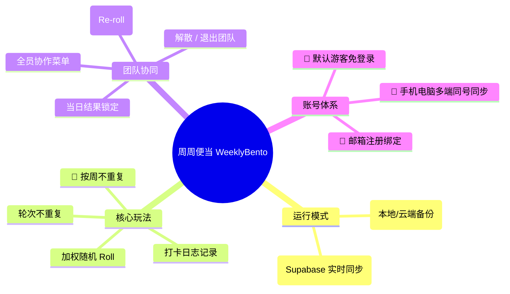
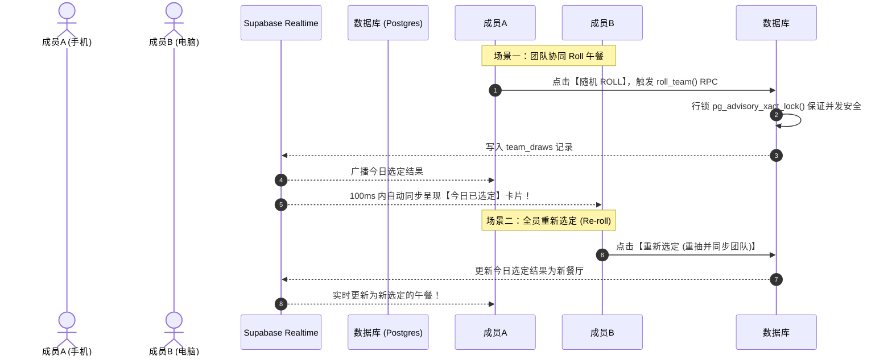

# 🍱 周周便当 (WeeklyBento) 玩法规则与复盘文档

> 本文档用于归纳总结《周周便当》系统的核心玩法、算法规则、团队协同逻辑与技术架构，方便后续产品复盘与维护扩展。

---

## 📌 一、 项目概览

《周周便当》是一款致力于解决**“今天中午吃什么”**终极难题的随机午餐决策与团队协同工具。系统兼顾个人独立使用与团队多人协同，具备高颜值 3D 老虎机滚轮动画、音效合成与全屏撒花特效。



---

## 🎲 二、 核心玩法与选餐算法规则

### 1. 加权随机 Roll 算法 (Weighted Random Selection)
- 每个午餐地点均具备权重值 `weight`（默认值 `1`）。
- **抽取逻辑**：系统计算待抽池中所有可用地点的权重总和 `totalWeight`，生成随机数 `target = Math.random() * totalWeight`，以此进行加权概率抽签。

### 2. 轮次去重机制 (Round Anti-Repeat)
- 开启轮次去重后，已抽中的地点将被标记为 `isDrawn = true` 并暂时移出待抽池。
- **循环复用**：当待抽池中所有地点均被抽过一遍时，系统自动清空已抽状态（或由用户手动重置），开启新一轮选餐。

### 3. 📅 按周不重复模式 (Weekly No-Repeat)
- **规则**：以自然周（**周一 00:00 至 周日 23:59**）为单位，自动识别并过滤本周内已经抽中吃过的餐厅。
- **自动保底逻辑**：若本周内已将待抽池中的未吃地点全吃了一遍，系统会自动退回基础池抽取，防止待抽池变空。
- **无缝重置**：新的一周（周一）开始时，本周历史去重列表自动清空刷新。

---

## 👥 三、 团队协同模式 (Team Workspace)

团队模式基于 **Supabase Realtime 实时长连接** 构建，专为公司部门、干饭小分队设计。



### 1. 当日选定结果锁定
- 每日首个 Roll 签的团队成员将为全团队锁定今日午餐结果。
- 其他成员打开应用时，直接呈现 **“👥 团队协同模式 · 今日已选定”** 卡片，展示餐厅名称、推荐菜品、人均消费及摇号人标识。

### 2. 🔄 全员可重新选定 (Re-roll)
- **规则**：团队内所有成员均具备重抽权限。
- 若团队对当前结果不满意，任何成员点击 **【重新选定】**，均可重新随机 Roll 签并实时同步给全团队。

### 3. 📝 全员协作菜单管理
- 团队内所有成员均可在管理面板中：
  - 添加新午餐地点；
  - 修改地点名称、Emoji、标签与推荐菜；
  - 批量文本导入（支持多行粘贴格式如：`地点名称 （标签：标签1, 标签2）`）；
  - 恢复/填充系统预设 16+ 经典美食地点池。

### 4. 📅 历史记录与团队补录
- **📅 每日记录展示周几**：所有历史记录与今日打卡记录，均精准包含“周几”（例如：`今天 (周二)`、`8月3日 (周一)`）。
- **📅 团队协同补录**：团队模式下支持团队成员自由补录过去或今日的选餐打卡记录，并可对团队历史记录进行修改与删除，实时广播全员同步。

### 5. 🔥 团队解散与 🚪 退出
- **解散团队 (Owner)**：团队创建所有者可在团队弹窗中点击【解散团队】，安全删除团队下所有云端数据，并自动将所有成员恢复为个人模式。
- **退出团队 (Member)**：普通成员可选择【退出团队】，主动解除团队关联。

---

## 👤 四、 账号体系与多端同步 (Auth System)

支持 **“游客免登录 + 可选注册绑定”** 的无缝账号体验：

| 身份类型 | 登录方式 | 数据同步范围 | 适用的使用场景 |
| :--- | :--- | :--- | :--- |
| **👻 匿名游客 (Guest)** | 首次打开自动生成 | 仅限当前浏览器 `localStorage` | 零门槛即开即用、单设备体验 |
| **👤 邮箱注册账号 (Authenticated)** | 邮箱 + 密码 登录 | **手机、电脑、多设备全端实时同步** | 跨设备使用、长期团队协同 |

### 无缝升级流程：
1. **电脑端**：游客身份下点击【注册/绑定】，输入邮箱密码升级为正式账号，原有数据自动关联。
2. **手机端**：打开网页点击【登录】，输入同一邮箱密码，**手机与电脑秒级识别为同一用户**，团队与菜单完全同步。

---

## 🛡️ 五、 数据库权限 (RLS) 架构复盘

Supabase 数据库使用严格的 **行级安全策略 (Row Level Security)** 进行隔离保护：

```sql
-- 团队成员鉴权 helper 函数
create or replace function public.is_team_member(target_team_id uuid)
returns boolean language sql stable security definer set search_path = public
as $$
  select exists (select 1 from team_members where team_id = target_team_id and user_id = auth.uid());
$$;

-- RLS 读写策略
create policy "members read teams" on public.teams for select using (public.is_team_member(id));
create policy "owners delete teams" on public.teams for delete using (exists (select 1 from team_members where team_id = id and user_id = auth.uid() and role = 'owner'));
create policy "members insert locations" on public.team_locations for insert with check (public.is_team_member(team_id));
create policy "members update locations" on public.team_locations for update using (public.is_team_member(team_id));
create policy "members delete locations" on public.team_locations for delete using (public.is_team_member(team_id));
create policy "members read draws" on public.team_draws for select using (public.is_team_member(team_id));
```

---

## 📄 六、 生产环境部署指引

- **上线发布命令**：
  ```bash
  npm run deploy
  ```
- **构建工作流**：执行 `vue-tsc -b && vite build` 打包构建 `dist`，并由 `gh-pages` 部署至 GitHub Pages。
- **在线部署 URL**：[https://wangdengbin.github.io/weeklybento/](https://wangdengbin.github.io/weeklybento/)
